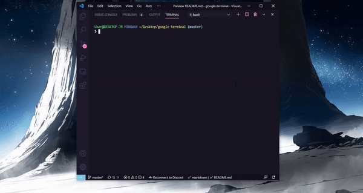

<h1 align='center'> Info System</h1>

<p align='center'>Info-system is a library that provides you see basic information about your Operational System in a beautiful way!</p>

# Install

```node
$ npm i info-system
```

# Usage

<p>Currently have just a few commands line:</p>

To show all infos

```node
$ info-system
```

<hr>

Show only memory infos

```node
$ info-system --memory
```

or

```node
$ info-system -m
```

<hr>

Show only processor infos

```node
$ info-system --processor
```

or

```node
$ info-system -p
```

<hr>

Show only OS infos

```node
$ info-system --operational
```

or

```node
$ info-system -os
```

<br />

### You can see here how it stay

<br />


